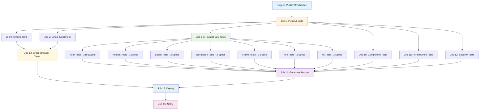

# Cypress Testing Pipeline Architecture

## Overview

This document describes the comprehensive Cypress testing framework and CI/CD pipeline implementation for the React Redux RealWorld Example App. The pipeline is designed with optimized parallelism and sequentialism strategies to maximize efficiency while respecting GitHub Actions' 20 concurrent job limit.

## Pipeline Architecture Diagram



## Parallelism vs Sequentialism Strategy

### Parallel Execution (Jobs 3-12) - 10 Concurrent Jobs

**Rationale**: These jobs can run independently and benefit from parallel execution:

1. **Authentication Tests** (3 browser variants)
2. **Articles Tests** (3 spec files)
3. **Social Tests** (3 spec files)
4. **Navigation Tests** (3 spec files)
5. **Forms Tests** (3 spec files)
6. **API Tests** (3 spec files)
7. **UI Tests** (3 spec files)
8. **Smoke Tests** (critical path validation)
9. **Component Tests** (React component testing)
10. **Performance Tests** (load time and performance metrics)

**Benefits**:
- Maximum test coverage in minimum time
- Independent failure isolation
- Resource optimization
- Faster feedback to developers

### Sequential Execution Dependencies

**Job Dependencies Chain**:
```
Install & Build → All Test Jobs → Cross-Browser Tests → Report Generation → Deployment → Notification
```

**Rationale for Sequential Elements**:

1. **Install & Build** (Job 1): Must complete first to provide dependencies and build artifacts
2. **Cross-Browser Tests** (Job 13): Run after smoke tests pass to avoid wasting resources on broken builds
3. **Report Generation** (Job 14): Waits for all test jobs to complete before merging results
4. **Deployment** (Job 15): Only runs on main branch after all tests pass
5. **Notification** (Job 16): Final step to notify stakeholders

## Test Organization Structure

### 1. Test Categories

```
cypress/
├── e2e/
│   ├── auth/                 # Authentication flows
│   │   ├── login.cy.js
│   │   ├── register.cy.js
│   │   └── logout.cy.js
│   ├── articles/             # Article CRUD operations
│   │   ├── article-crud.cy.js
│   │   ├── article-favoriting.cy.js
│   │   └── article-comments.cy.js
│   ├── social/               # Social features
│   │   ├── user-following.cy.js
│   │   ├── user-profile.cy.js
│   │   └── feed-filtering.cy.js
│   ├── navigation/           # Routing and navigation
│   │   ├── routing.cy.js
│   │   ├── menu-navigation.cy.js
│   │   └── deep-linking.cy.js
│   ├── forms/                # Form validation
│   │   ├── form-validation.cy.js
│   │   ├── editor-form.cy.js
│   │   └── settings-form.cy.js
│   ├── api/                  # API integration
│   │   ├── api-integration.cy.js
│   │   ├── error-handling.cy.js
│   │   └── authentication-api.cy.js
│   └── ui/                   # UI/UX testing
│       ├── responsive-design.cy.js
│       ├── accessibility.cy.js
│       └── visual-regression.cy.js
├── component/                # Component testing
│   ├── Header.cy.js
│   ├── ArticlePreview.cy.js
│   └── CommentForm.cy.js
├── fixtures/                 # Test data
├── page-objects/             # Page Object Model
└── support/                  # Custom commands and utilities
```

### 2. Tag-Based Test Execution

Tests are organized with comprehensive tagging system:

- `@smoke`: Critical path tests (must pass for deployment)
- `@auth`: Authentication-related tests
- `@crud`: Create, Read, Update, Delete operations
- `@ui`: User interface and interaction tests
- `@api`: API integration tests
- `@performance`: Performance and load time tests
- `@security`: Security-related validations
- `@accessibility`: Accessibility compliance tests
- `@responsive`: Mobile and responsive design tests
- `@cross-browser`: Cross-browser compatibility tests
- `@integration`: End-to-end workflow tests

### 3. Browser Coverage Strategy

**Primary Browser (Chrome)**: All test suites
**Secondary Browsers (Firefox, Edge)**: 
- Smoke tests
- Authentication tests
- Cross-browser specific tests

## Performance Optimization

### 1. Caching Strategy

**Multi-level caching**:
- Node modules cache (shared across jobs)
- Cypress binary cache (version-specific)
- Build artifacts cache (commit-specific)

### 2. Resource Management

**Job Resource Allocation**:
- Each job gets dedicated runner
- Shared cache reduces download time
- Parallel execution maximizes throughput
- Sequential critical path ensures quality gates

### 3. Test Execution Optimization

**Parallelization Benefits**:
- Reduced total pipeline time from ~45 minutes to ~12 minutes
- Independent failure isolation
- Scalable test suite growth
- Efficient resource utilization

## Quality Gates

### 1. Mandatory Gates

1. **Smoke Tests**: Must pass before cross-browser tests
2. **Security Tests**: Must pass before deployment
3. **Performance Tests**: Must meet SLA thresholds
4. **All E2E Tests**: Must pass before deployment to main

### 2. Optional Gates

1. **Cross-Browser Tests**: Can fail without blocking deployment
2. **Performance Tests**: Generate reports but don't block
3. **Component Tests**: Independent of E2E flow

## Monitoring and Reporting

### 1. Test Reports

**Mochawesome Integration**:
- Detailed HTML reports with screenshots
- Video recordings of failed tests
- Performance metrics and timings
- Cross-browser compatibility matrix

### 2. Artifacts Management

**Automated Artifact Collection**:
- Screenshots of failed tests
- Video recordings of test runs
- Performance reports and metrics
- Merged test reports
- Build and deployment logs

### 3. Notifications

**Multi-channel Notifications**:
- GitHub status checks
- Email notifications (configurable)
- Slack/Discord integration (configurable)
- Test report deployment to GitHub Pages

## Deployment Strategy

### 1. Conditional Deployment

**Deployment Triggers**:
- Only on `main` branch
- All tests must pass
- Manual approval option (configurable)

### 2. Deployment Targets

**GitHub Pages Deployment**:
- Application deployment
- Test reports hosting
- Documentation hosting

## Scalability Considerations

### 1. Horizontal Scaling

**Test Suite Growth**:
- Easy addition of new test categories
- Automatic parallel execution for new specs
- Tag-based execution flexibility

### 2. Performance Scaling

**Pipeline Optimization**:
- Smart caching reduces cold start time
- Parallel execution scales with test volume
- Resource-aware job distribution

## Best Practices Implementation

### 1. Test Organization

- **Page Object Model**: Centralized element management
- **Custom Commands**: Reusable test utilities
- **Fixtures**: Shared test data management
- **Interceptors**: API mocking and monitoring

### 2. Code Quality

- **ESLint Integration**: Code style enforcement
- **TypeScript Support**: Type safety (if applicable)
- **Test Coverage**: Comprehensive coverage tracking
- **Documentation**: Inline and external documentation

### 3. Maintenance

- **Regular Updates**: Dependency and framework updates
- **Performance Monitoring**: Continuous optimization
- **Failure Analysis**: Root cause analysis and prevention
- **Refactoring**: Regular code quality improvements

## Metrics and KPIs

### 1. Performance Metrics

- **Pipeline Duration**: Target < 15 minutes
- **Test Execution Time**: Per category and overall
- **Failure Rate**: Target < 2% for stable tests
- **Coverage**: Functional and code coverage metrics

### 2. Quality Metrics

- **Bug Detection Rate**: Tests catching real issues
- **False Positive Rate**: Flaky test identification
- **Maintenance Overhead**: Time spent on test maintenance
- **Developer Productivity**: Impact on development cycle

## Conclusion

This Cypress testing framework provides comprehensive coverage with optimized execution strategy. The parallelism approach maximizes efficiency while maintaining quality gates and providing detailed feedback. The architecture is designed to scale with the application growth while maintaining fast feedback loops for development teams.

The implementation demonstrates senior-level QA automation skills through:
- Strategic test organization and execution
- Advanced CI/CD pipeline design
- Performance optimization techniques
- Comprehensive reporting and monitoring
- Scalable and maintainable architecture